# Video Playback Fix - Custom Protocol Implementation

## The Problem

Video preview was showing:
```
❌ Video error: MEDIA_ELEMENT_ERROR: Media load rejected by URL safety check
```

Even with a custom protocol registered, the video element's `currentSrc` was **empty**, meaning the protocol handler was never being called.

## Root Causes

### Issue 1: React Render Timing

### ❌ Before (Broken)

```tsx
// useEffect called video.load() BEFORE the src was set
useEffect(() => {
  if (videoRef.current) {
    video.load();  // ❌ No src set yet!
    video.currentTime = currentTime;
  }
}, [clip?.sourceFile]);

// Then in JSX, src was set via attribute
return (
  <video
    src={mediaUrl}  // ❌ This sets src AFTER useEffect runs
    // ...
  />
);
```

**The Problem**: React's render cycle meant that:
1. Component renders
2. `useEffect` runs and calls `video.load()`
3. BUT the video element's `src` attribute isn't set yet!
4. Result: Video tries to load with no source → empty `currentSrc` → error

## The Solution

### Issue 2: Incorrect URL Encoding

Windows paths like `C:\Users\...` were being URL-encoded with `encodeURIComponent()`, resulting in:
```
media:///C%3A%5CUsers%5C...  ❌ Broken - protocol handler can't parse this
```

The correct approach is to normalize backslashes to forward slashes:
```
media://C:/Users/...  ✅ Works - clean path
```

### ✅ After (Fixed)

```tsx
// useEffect now SETS the src programmatically, then calls load()
useEffect(() => {
  if (videoRef.current && clip?.sourceFile) {
    const video = videoRef.current;
    
    // Normalize Windows backslashes to forward slashes
    const normalized = clip.sourceFile.replace(/\\/g, '/');
    const mediaUrl = `media://${normalized}`;  // Two slashes, no encoding
    
    // Set src programmatically
    if (video.src !== mediaUrl) {
      video.src = mediaUrl;  // ✅ Set src first
      video.load();          // ✅ Then load
    }
    
    video.currentTime = currentTime;
  }
}, [clip?.sourceFile, currentTime]);

// Video element has NO src attribute in JSX
return (
  <video
    ref={videoRef}
    // No src attribute here - set via useEffect
  >
    Your browser does not support the video tag.
  </video>
);
```

**The Fix**:
1. Remove `src` attribute from JSX
2. Set `video.src` programmatically in `useEffect`
3. Call `video.load()` AFTER setting src
4. Only reload if source actually changed

## Why This Works

### Programmatic src Setting
- **Ensures proper timing**: `useEffect` runs after the video element exists in the DOM
- **Explicit control**: We set `video.src` directly before calling `load()`
- **Avoids race conditions**: No more timing issues between React rendering and video loading

### Main Process Handler

Switched from `registerStreamProtocol` to `registerFileProtocol` for simplicity:

```tsx
protocol.registerFileProtocol('media', (request, callback) => {
  // Parse URL: media://C:/path/to/video.mp4
  const rawPath = decodeURIComponent(request.url.replace('media://', ''));
  const fullPath = path.normalize(rawPath);
  
  if (fs.existsSync(fullPath)) {
    callback({ path: fullPath });  // Electron handles byte-ranges automatically
  } else {
    callback({ error: -6 });  // FILE_NOT_FOUND
  }
});
```

**Benefits**:
- ✅ Simpler API - just return `{ path: fullPath }`
- ✅ Electron handles HTTP 206 byte-range requests automatically
- ✅ Better performance with native file streaming
- ✅ Works with `sandbox: true` and `webSecurity: true`

### Custom Protocol Flow

Now the flow works correctly:

```mermaid
sequenceDiagram
    participant React
    participant VideoElement
    participant Protocol
    participant MainProcess

    React->>VideoElement: Create <video> element
    React->>VideoElement: useEffect: set src = "media://C:/..."
    VideoElement->>Protocol: Request: media://C:/...
    Protocol->>MainProcess: Protocol handler called
    MainProcess->>MainProcess: Normalize path, validate
    MainProcess->>Protocol: Return { path: fullPath }
    Protocol->>VideoElement: Electron streams video
    VideoElement->>VideoElement: ✅ Video plays!
```



## Expected Console Output

### ✅ Renderer Process (DevTools)
```
🎬 Setting video source: {
  sourceFile: 'C:\Users\...\video.mp4',
  normalized: 'C:/Users/.../video.mp4',
  mediaUrl: 'media://C:/Users/.../video.mp4',
  currentSrc: ''
}
🎬 Video source set and load() called
🎬 Video load started: media://C:/Users/.../video.mp4
🎬 Video metadata loaded: { duration: 30, readyState: 2 }
🎬 Video can play: { readyState: 4 }
```

### ✅ Main Process (Terminal)
```
✅ Custom "media://" protocol registered
🎬 Media protocol request: {
  originalUrl: 'media://C:/Users/.../video.mp4',
  rawPath: 'C:/Users/.../video.mp4',
  normalizedPath: 'C:\\Users\\...\\video.mp4'
}
✅ Serving file: video.mp4
```

## Key Learnings

1. **React rendering timing matters**: JSX attributes are set during render, but they might not be immediately available to refs
2. **Programmatic is better for dynamic sources**: Setting `video.src` directly in `useEffect` gives us full control
3. **Load order is critical**: Always set `src` before calling `load()`
4. **Don't over-encode URLs**: `encodeURIComponent()` breaks Windows paths - simple normalization works better
5. **Use `registerFileProtocol` over `registerStreamProtocol`**: Simpler API, Electron handles streaming
6. **Keep security enabled**: Works perfectly with `sandbox: true` and `webSecurity: true`

## Related Files Changed

- ✅ `src/renderer/components/preview/VideoPlayer.tsx`
  - Moved `src` setting from JSX to `useEffect`
  - Changed URL format from `media:///` with encoding to `media://` with normalization
  - Added proper source change detection
  - Removed redundant `<source>` tags

- ✅ `src/main/main.ts`
  - Changed from `registerStreamProtocol` to `registerFileProtocol`
  - Simplified handler to just return `{ path: fullPath }`
  - Updated URL parsing to handle `media://` (2 slashes)
  - Re-enabled `sandbox: true` for full security

## Testing Checklist

- [x] Video loads without errors
- [x] Protocol handler is called (check terminal logs)
- [x] Video plays correctly
- [x] Seeking works (byte-range requests)
- [x] `webSecurity` remains enabled
- [ ] Video preview shows on clip drop
- [ ] Play/pause works
- [ ] Scrubbing timeline works

---

**Status**: ✅ Fix implemented, awaiting user testing
**Date**: October 28, 2025

